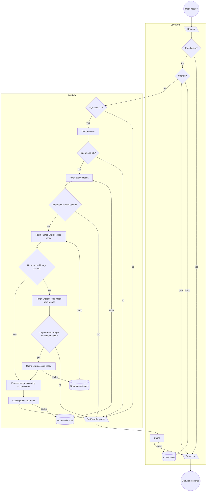

# miniaturs
[](https://github.com/lloydmeta/miniaturs/actions/workflows/ci.yaml)

Tiny HTTP image resizer.

## Goals

* Secure 
* Fast: 
  * Startup should be in the low 2-digit ms range (e.g., avoid "oh, it's a lambda")
  * Processing should be quick
* Cheap: 
  * Pay as little as possible and avoid unnecessary work
  * Being fast can help minimise costs
* Scalable: can handle lots of requests
* Thumbor-ish
* A good net citizen (don’t make requests to third parties if we have it in cache)
* Debuggable

To fulfil the above:

* Runs in a Lambda
  * Running on ARM, [because it's cheaper](https://blog.awsfundamentals.com/aws-lambda-pricing-a-complete-guide-to-understanding-the-cost-of-the-serverless-service#heading-architectures-arm-vs-x86-arm-is-cheaper): "about 34% cheaper compared to the default x86 processors"
* Rust ⚡️
* Caching in layers: CDN to protect the app, with S3 for storing images
* Serverless, but built on HTTP framework ([cargo-lambda](https://www.cargo-lambda.info) on top of [axum](https://github.com/tokio-rs/axum))

An example Terraform config in `terraform/prod` is provided to show how to deploy at a subdomain using Cloudflare as our ([free!](https://www.cloudflare.com/en-gb/plans/free/)) CDN + WAF with AWS Lambda and S3 ([also free!](https://aws.amazon.com/free/))

## Usage:

We only support resizing at the moment

1. An "image" endpoint [a la Thumbor](https://thumbor.readthedocs.io/en/latest/usage.html#image-endpoint)
2. A "metadata" endpoint [a la Thumbor](https://thumbor.readthedocs.io/en/latest/usage.html#metadata-endpoint)
    * Difference: target image size is _not_ returned (might change in the future)

### Confguration

miniaturs relies on environment variables for configuration. These include

* `MINIATURS_SHARED_SECRET`   : required, used for signature verification
* `UNPROCESSED_IMAGES_BUCKET` : required, bucket used for caching unprocessed images
* `PROCESSED_IMAGES_BUCKET`   : required, bucket used for caching processed images
* `REQUIRE_PATH_STYLE_S3`     : optional, whether to use "path style" S3 addressing (for local testing), defaults to false.
* `MAX_RESIZE_TARGET_WIDTH`   : optional, max resize-to image width, defaults to 10,000 (pixels)
* `MAX_RESIZE_TARGET_HEIGHT`  : optional, max resize-to image height, defaults to 10,000 (pixels)
* `MAX_SOURCE_IMAGE_WIDTH`    : optional, max source image width, defaults to 10,000 (pixels)
* `MAX_SOURCE_IMAGE_HEIGHT`   : optional, max source image height, defaults to 10,000 (pixels)
* `MAX_IMAGE_DOWNLOAD_SIZE`   : optional, max source image download size (as reported by content-length header), defaults to 10mb (must be parseable by [bytesize](https://crates.io/crates/bytesize))
* `MAX_IMAGE_FILE_SIZE`       : optional, max source (post-download) image size, defaults to 10mb (must be parseable by [bytesize](https://crates.io/crates/bytesize))

## Flow



## Development

### Rust

Assuming we have the [Rust toolbelt installed](https://doc.rust-lang.org/cargo/getting-started/installation.html#install-rust-and-cargo), the main thing we need is `cargo-lambda`

```sh
❯ brew tap cargo-lambda/cargo-lambda
```

### AWS

* `brew install awscli` to install the CLI
* Log into your app

Ensure:

* `aws configure sso` is done
* `.aws/config` has the correct profile configuration, with a `[profile ${PROFILE_NAME}]` line where `PROFILE_NAME` matches what is in `main.tf`

#### Login for Terraform

`aws sso login --profile ${PROFILE_NAME}`

### Cloudflare

Ensure `CLOUDFLARE_API_TOKEN` is defined in the environment (needed for Cloudflare provider and cache busting). It’ll need privileges for updating DNS and cache settings.

## Deploying

### Terraform

* Use tfenv: https://formulae.brew.sh/formula/tfenv
* Check what version is needed and install using ^

* For local dev, `localstack` is used (see terraform/localdev/docker-compose.yaml), and `tflocal` is used (https://formulae.brew.sh/formula/terraform-local)
  * `docker-compose` through official Docker _or_ Rancher is supported, but [enabling admin access](https://github.com/rancher-sandbox/rancher-desktop/issues/2534#issuecomment-1909912585) is needed for running tests with Rancher

### Per Environment

Use `Makefile` targets.

* For local dev:
    * `make start_dev_env provision_dev_env`
    * `make begin_dev`
    * `TO_SIGN="200x-100/https://beachape.com/images/octopress_with_container.png" make signature_for_localstack` to get a signed path for dev env
    * `TO_SIGN="200x-100/https://beachape.com/images/octopress_with_container.png" make signature_for_dev` to get a signed path for dev
* For prod:
    * Copy and customise:
      * `main.tf.example` to `main.tf`
      * `terraform.tfvars.example` to `terraform.tfvars`
    * `make plan_prod` to see changes
    * `make provision_prod` to apply changes
    * `TO_SIGN="200x-100/https://beachape.com/images/octopress_with_container.png" make signature_for_prod` to get a signed path

## To Explore

* Image resizing 
  * https://imgproxy.net/blog/almost-free-image-processing-with-imgproxy-and-aws-lambda/
  * https://zenn.dev/devneko/articles/0a6fb5c9ea5689
  * https://crates.io/crates/image
* [Logs, tracing](https://github.com/tokio-rs/tracing?tab=readme-ov-file#in-applications)